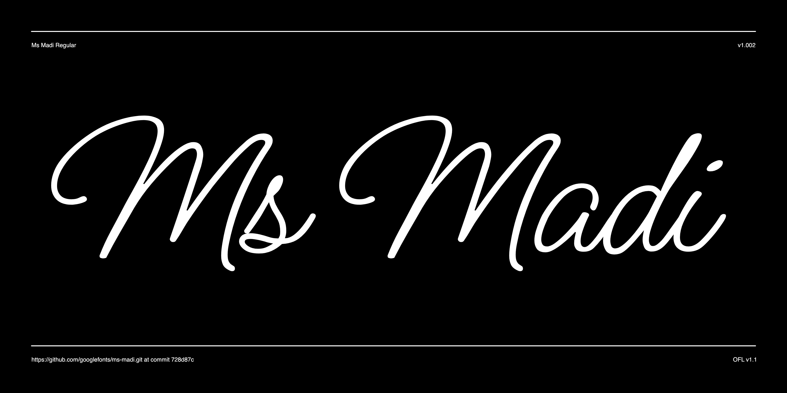

# Ms Madi

Ms Madi is a monoline hand written script. It's clean connections and quite legible hand written cursive style works great in situations that require a relatively sophisticated casual look. As with any cursive script, it is never a good idea to use this font in all capital letters.



## Building the Fonts

The font is built using fontmake and gftools post processing script. Tools are all python based, so it must be previously installed.

To install all the Python tools into a virtualenv, do the following:

From terminal:

```

cd your/local/project/directory

#once in the project folder create a virtual environment. 
This step has to be done just once, the first time:

python3 -m venv venv

#activate the virtual environment

source venv/bin/activate

#install the required dependencies

pip install -r requirements.txt

```

Then run the this command:

```
cd sources
gftools builder config.yml
```
